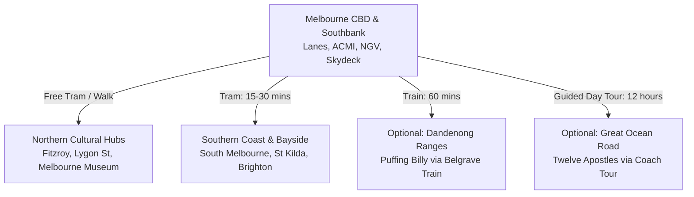

# Melbourne 3-4 Day Trip Planning Strategy (No-Car & Museum Focused)

This document outlines an optimized travel strategy for a 3-to-4-day trip to Melbourne. Since you are not driving, this strategy focuses entirely on Melbourne's world-class public transport, walkability, and central enclaves. Far-away day trips are kept strictly **optional** (with zero driving needed, utilizing guided passenger coaches or trains), while Melbourne's premier inner-city museums and art galleries are integrated directly into the core itinerary.

---

## 1. Geographic Analysis (Geo & Logistics)

Melbourne is laid out in a highly organized grid (the Hoddle Grid) surrounded by cultural suburbs and bayside beaches. Grouping activities geographically is essential to avoid wasting time commuting.

### The Key Regions:
*   **CBD & Southbank (Flinders St, Laneways, Southbank, Yarra River):** The metropolitan core. Home to **ACMI** and the **Immigration Museum**. 
*   **Melbourne Arts Precinct (South of CBD/Yarra River):** Home to the world-renowned **National Gallery of Victoria (NGV International)** and Arts Centre Melbourne.
*   **Carlton & Fitzroy (Just North of CBD):** Home to the historic **Melbourne Museum**, UNESCO Royal Exhibition Building, Carlton Gardens, and Lygon Street.
*   **Bayside (St Kilda & Brighton):** Sandy beaches, historic coastal markets, and the St Kilda penguin breakwater.
*   **Optional Out-of-City Excursions (Dandenong Ranges or Great Ocean Road):** Purely scenic trips. **No driving required**—accessible via metropolitan train lines or guided coach day tours.

---

## 2. Transportation Strategy (100% Car-Free)

You do not need a driver's license to fully experience Melbourne. The city's transit system is optimized for pedestrians.

### Public Transport (Tram, Train, Bus)
> [!IMPORTANT]
> Since you cannot drive, staying within the CBD or Arts Precinct puts you inside the **Free Tram Zone**, meaning your transport costs for city days will be nearly $0.

*   **Free Tram Zone:** All trams running within the Melbourne CBD grid and Docklands are free. You do **not** need to tap on or off with a Myki card as long as your entire trip starts and ends within this zone.
*   **Myki Card:** For any travel outside the CBD (e.g., St Kilda, Brighton, Fitzroy, or Belgrave), you must buy a physical **Myki Card** (cost is $6 AUD) and load it with Myki Money. Tap on when boarding trams (no need to tap off on trams) and tap on and off at train gates.
*   **Transit Fares Cap:** Daily public transport fares are capped at around $10.60 AUD, meaning all train, tram, and bus travel after your first two trips of the day is free.
*   **Airport Connection:** Take the **SkyBus** from Melbourne Airport (Tullamarine) directly to Southern Cross Station in the CBD (~20-30 minutes, ~$22 AUD one-way). No local trains run from the airport.

---

## 3. Accommodation Strategy

Staying in a central transport hub is critical when navigating without a car.

### Recommended Stays (CBD / Flinders Street Corridor):
*   **Budget:** [Space Hotel](https://spacehotel.com.au/) (modern hybrid hostel/hotel near Carlton Gardens) or [YHA Melbourne Central](https://www.yha.com.au/hostels/vic/melbourne/melbourne-central/) (Flinders Street).
*   **Boutique:** [Ovolo Laneways](https://www.ovolohotels.com/ovolo/laneways/) (Little Bourke St) or [The Quincy Hotel](https://quincymelbourne.com/) (Flinders Lane).
*   **Premium:** [The Ritz-Carlton Melbourne](https://www.ritzcarlton.com/en/hotels/melrzt-the-ritz-carlton-melbourne/overview/) (Flinders Street west end) or [Grand Hyatt Melbourne](https://www.hyatt.com/en-US/hotel/australia/grand-hyatt-melbourne/melbo) (Collins Street).

---

## 4. Optimized 3-4 Day Itinerary (Museum & Transit Focused)

This itinerary integrates Melbourne's premier museums and galleries, keeping far-away excursions as flexible, optional add-ons.

### Day 1: Historic Lanes, Coffee & Cultural Museums (CBD & Carlton)
*   **Morning:** Start in the CBD with coffee at **Degraves Street** or **Centre Place**. Wander the famous graffiti-covered laneways like **Hosier Lane**. Walk to the [State Library Victoria](https://www.slv.vic.gov.au/) to admire the majestic domed La Trobe Reading Room.
*   **Lunch:** Walk or take a free tram north to Lygon Street (Carlton) for Italian dining at [Brunetti Classico](https://www.brunetticlassico.com.au/).
*   **Afternoon (Museum Highlight):** Spend the afternoon at the **[Melbourne Museum](https://museumsvictoria.com.au/melbournemuseum/)** in Carlton Gardens. Explore the Bunjilaka Aboriginal Cultural Centre, the Forest Gallery, and view the historic UNESCO-listed Royal Exhibition Building right outside.
*   **Evening:** Return to the CBD via the free tram. Walk down the **Southbank Promenade** along the Yarra River and go up the [Melbourne Skydeck](https://www.melbourneskydeck.com.au/) (Eureka Tower) for the highest 360-degree sunset views in the city.

### Day 2: Bayside Vibe, Art Galleries & Sunset Penguins (South Melbourne & St Kilda)
*   **Morning:** Take the Route 96 tram to the historic **South Melbourne Market** (note: closed Mondays, Tuesdays, and Thursdays). Enjoy breakfast pastries at the famous [Agathé Pâtisserie](https://www.agathe.com.au/).
*   **Mid-day (Museum Highlight):** Take the tram to the **[National Gallery of Victoria (NGV International)](https://www.ngv.vic.gov.au/)** on St Kilda Road. Walk under the famous water wall and view the world-class international art collections beneath the giant stained-glass ceiling (permanent exhibits are free).
*   **Afternoon:** Take the tram further south to **St Kilda**. Walk down the palm-lined Esplanade, visit Acland Street for its famous cake shops, and take photos at the historic Luna Park gate.
*   **Sunset/Evening:** Walk out onto the **St Kilda Pier Breakwater** at dusk to see the wild colony of Little Penguins return to shore (free). Head to [Hotel Esplanade](https://hotelesplanade.com.au/) (The Espy) for dinner.

### Day 3: City History & Moving Image OR Optional Great Ocean Road Tour
*   **Option A: City Culture & History (Stay in CBD - No Car)**
    *   **Morning:** Visit **[ACMI (Australian Centre for the Moving Image)](https://www.acmi.net.au/)** at Federation Square. Immerse yourself in the interactive galleries showcasing film, television, and video game history (free centerpiece exhibition).
    *   **Lunch:** Dine at Federation Square or grab a sandwich at Flinders Lane.
    *   **Afternoon:** Visit the **[Immigration Museum](https://museumsvictoria.com.au/immigrationmuseum/)** on Flinders Street to explore stories of people who shaped modern Melbourne. Afterwards, walk up to the historic **[Old Melbourne Gaol](https://www.oldmelbournegaol.com.au/)** on Russell Street, where Australia’s most infamous bushranger, Ned Kelly, was held.
    *   **Evening:** Wind down with a craft cocktail hidden behind the bookcase at [Eau De Vie](https://eaudevie.com.au/melbourne/) or inside the shipping container bar [Section 8](https://section8.com.au/).
*   **Option B (Optional Out-of-City Excursion): Great Ocean Road Day Tour (No Driving Needed)**
    *   Book a full-day guided coach tour from the CBD. Let a professional driver navigate the narrow cliffside roads while you sit back and enjoy the coastal views of the **Twelve Apostles**, Loch Ard Gorge, and wild koalas at Kennett River.

### Day 4: Outer Nature & Steam Rail OR Suburb Culture & Sports Museum
*   **Option A (Optional Out-of-City Excursion): Puffing Billy & Wild Kangaroos (No Driving Needed)**
    *   **Morning:** Take the Belgrave Line metropolitan train from Flinders Street Station straight to Belgrave (1 hour). Walk to the [Puffing Billy Railway](https://puffingbilly.com.au/) station and board the historic steam train winding through the mountain ash forests.
    *   **Afternoon:** Catch the train back and transfer to Bus 905 to **Westerfolds Park** in Templestowe. Arrive 2 hours before sunset to see hundreds of wild Eastern Grey Kangaroos feeding on the open grasslands.
*   **Option B: Inner-City Arts & Sports Heritage (Stay in CBD/East - No Car)**
    *   **Morning:** Walk through the Fitzroy Gardens to see Cook's Cottage and the Conservatory. Head to the Melbourne Cricket Ground (MCG) for a tour and visit the **[Australian Sports Museum](https://www.australiansportsmuseum.org.au/)** inside.
    *   **Afternoon:** Explore the hipster enclave of **Fitzroy** (take the tram to Brunswick Street). Browse independent bookshops, vintage clothing stores, and see local street art murals.
    *   **Evening:** Enjoy a farewell dinner at the vibrant Southeast Asian hotspot [Chin Chin](https://www.chinchin.melbourne/) on Flinders Lane.

---

## 5. Cost-Saving Strategy (Best Money Value)

*   **Museum Freebies:** The **NGV International** permanent galleries, the **State Library Victoria**, and the main **ACMI** exhibitions are **100% free** to enter.
*   **St Kilda Penguins:** Avoid spending $150+ AUD on tours to Phillip Island. The wild colony of little penguins at St Kilda Pier breakwater is **free** and accessible by a local tram.
*   **Transit Cap:** Public transport fares cap daily (around $10.60 AUD). If traveling to Belgrave or Brighton, all subsequent trams, trains, and buses for the rest of that day are free.
