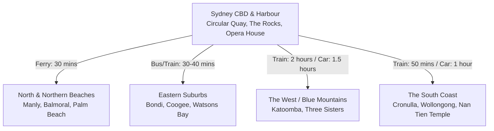

# Sydney 5-6 Day Trip Planning Strategy

This document outlines a optimized travel strategy for a 5-to-6-day trip to Sydney. It is based on a synthesis of local insights, travel itineraries, and visitor experiences, focusing on geographic logistics, cost efficiency, public transit vs. car rental trade-offs, and accommodation choices.

---

## 1. Geographic Analysis (Geo & Logistics)

Sydney is geographically vast and divided by its harbor, coastlines, and national parks. Planning your days by geographic clusters is critical to avoid spending hours in traffic.

### The Key Regions:
*   **CBD & Inner Suburbs (Circular Quay, The Rocks, Darling Harbour, Paddington, Surry Hills):** The central hub. Highly walkable and the transit node for all ferries, trains, and light rail.
*   **Eastern Suburbs (Bondi, Coogee, Watsons Bay):** Coastal strip east of the CBD. Famously scenic, home to popular coastal walks and ocean pools.
*   **Manly & Northern Beaches (Balmoral, Manly, Avalon, Palm Beach):** Stretches north from the harbor to the tip of the peninsula (Palm Beach).
*   **Blue Mountains (Katoomba):** Roughly 100 km west of Sydney. A mountainous wilderness area famous for the Three Sisters rock formation and hiking trails.
*   **South Coast (Cronulla, Wollongong):** Chilled-out surf beaches and home to the Nan Tien Buddhist Temple, located 80 km south of Sydney.

---

## 2. Transportation Strategy (Bus/Train vs. Rent Car)

One of the biggest mistakes visitors make is renting a car for their entire Sydney stay. 

### Public Transport (Bus, Train, Light Rail, Ferry)
> [!TIP]
> Public transport is the **best money value** and most efficient way to navigate the CBD, Eastern Suburbs, and Manly.

*   **Payment:** You do not need to buy paper tickets. Simply tap on and off using a contactless credit/debit card, phone wallet, or an **Opal Card** (available at stations/newsagents).
*   **Fares & Caps:** Transport NSW applies daily and weekly caps (e.g., daily caps around $18 AUD, with significantly cheaper rates on weekends). Ferries are included in this cap, making them an incredibly cheap way to sightsee.
*   **Traffic & Parking:** Driving in the CBD is highly stressful due to complex one-way systems, aggressive traffic, and toll roads. Parking is exceptionally expensive ($16 to $35+ AUD per hour in multi-story car parks).

### Renting a Car
*   **When to rent:** Only rent a car for **out-of-town day trips** (like the Northern Beaches, Wollongong/South Coast, or deep into the Blue Mountains).
*   **Where to pick up:** Rent the car from a location outside the CBD (such as near the airport or outer suburbs) for only the specific days you need it, avoiding city center parking fees.

---

## 3. Accommodation Strategy

Your choice of accommodation dictates how much time you waste commuting. Based on your preference, **staying in a central hub (CBD, Circular Quay, or The Rocks)** is highly recommended.

### Why a Central Hub?
*   **Transit Connectivity:** You will be at the main terminus for all ferries, trains, and light rail. Direct airport link trains stop at Central, Museum, and Circular Quay.
*   **Time Savings:** No need to transfer between buses and trains to get across the harbor or to outer suburbs like Newtown.

### Recommended Stays in the CBD/Rocks:
*   **Budget:** [Sydney Harbour YHA](https://www.yha.com.au/hostels/nsw/sydney-surrounds/sydney-harbour/) (rooftop harbor views, located in the historic Rocks).
*   **Boutique:** [The Ultimo](https://www.theultimo.com.au/) (Chinatown) or [The Woolstore 1888 by Ovolo](https://www.ovolohotels.com/ovolo/woolstore1888/) (Pyrmont).
*   **Premium:** [Four Seasons Sydney](https://www.fourseasons.com/sydney/) or [Park Hyatt Sydney](https://www.hyatt.com/en-US/hotel/australia/park-hyatt-sydney/sydph) (luxury harbor-front stays).

---

## 4. Optimized 5-6 Day Itinerary

This itinerary balances active sightseeing, beach time, culture, and day trips while minimizing backtracking.

### Day 1: Icons of the Harbour & Historic Rocks (No Car)
*   **Morning:** Start in the leafy suburb of **Paddington**. Grab a coffee at [Ampersand Cafe](https://www.google.com/search?q=Ampersand+Cafe+Paddington) and explore the Paddington Reservoir Gardens.
*   **Afternoon:** Walk through **Hyde Park** (visit the Art Deco ANZAC War Memorial) and the **Royal Botanic Garden**, ending at the **Sydney Opera House**. Afterward, make your way to Darling Harbour to visit the **Sea Life Sydney Aquarium** and experience the underwater glass tunnels filled with sharks, dugongs, and penguins.
*   **Evening:** Explore the historic cobblestone alleys of **The Rocks**. Grab a drink at one of Sydney's oldest pubs, [The Hero of Waterloo](https://www.heroofwaterloo.com.au/).
*   **Budget View:** Walk across the pedestrian path of the **Sydney Harbour Bridge** to Kirribilli at sunset for free, panoramic harbor views.

### Day 2: Iconic Coastal Walk & alternative Newtown (No Car)
*   **Morning:** Catch a bus to **Bondi Beach**. Walk the famous **Bondi to Coogee Coastal Walk** (10km). Stop for a swim in the ocean pools at Bronte Beach or Clovelly.
*   **Lunch:** Dine at Coogee Beach (try local favorite [Chargrill Charlie's](https://chargrillcharlies.com/) for roast chicken and salads).
*   **Afternoon/Evening:** Take a bus/train to **Newtown** in the Inner West. Explore the vintage shops, street art, and sample craft beer at [Young Henrys](https://younghenrys.com/) or [The Grifter Brewing Co.](https://thegrifter.com.au/). 
*   **Dinner:** Grab Neapolitan pizza at [Bella Brutta](https://www.bellabrutta.com.au/) or Egyptian street food at [Cairo Takeaway](https://www.cairotakeaway.com/).

### Day 3: Manly, Headlands & Ferries (No Car)
*   **Morning:** Take the **Manly Ferry** from Circular Quay. Sit outside for a cheap, stunning harbor cruise. Grab pastries at [Fika Swedish Kitchen](https://www.fikaswedishkitchen.com.au/) in Manly.
*   **Hike Options:**
    *   *Scenic/Long:* The 10km **Spit to Manly Walk** featuring harbor beaches and Aboriginal rock art.
    *   *Leisurely/Short:* Loop walk from Manly Beach to **Shelly Beach** (great for snorkeling), continuing up the headland to Collins Flat Beach.
*   **Afternoon/Evening:** Chill out on the beach. Look for the colony of little penguins that nest under the Manly Wharf around sunset. Grab dinner at [Hemingway's Manly](https://www.hemingwaysmanly.com.au/).

### Day 4: Day Trip to the Blue Mountains (Train-Based)
*   **Morning:** Take the Blue Mountains Line (BMT) train from Central Station directly to **Katoomba** (~2 hours, relaxing and highly budget-friendly). Walk or take a local bus from Katoomba station to Echo Point to view the iconic **Three Sisters** rock formation.
*   **Afternoon:** Explore local hiking trails (such as the Prince Henry Cliff Walk) or ride the Scenic Cableway and Railway at **Scenic World** (the steepest passenger railway in the world). 
*   **Evening:** Board the return train back to Central Station. Grab a late dinner nearby in Surry Hills or Chinatown.

### Day 5: Northern Beaches & Coastal Drive (Rental Car Required)
*   **Morning:** Pick up your rental car. Stop at **Balmoral Beach** (sheltered harbor beach) for breakfast at [The Boathouse Balmoral](https://theboathousebalmoral.com.au/).
*   **Mid-day:** Drive north through the Northern Beaches (stopping at Avalon or Whale Beach) up to **Palm Beach**. 
*   **Hike:** Do the 3km return walk to **Barrenjoey Lighthouse** for views of the Pittwater estuary and the ocean.
*   **Evening:** Drop off the rental car. Treat yourself to dinner at [Mr Wong](https://www.merivale.com/venues/mrwong/) in the CBD (exceptional dim sum) and cocktails at a speakeasy like [Palmer & Co.](https://www.merivale.com/venues/palmerandco/) or [The Baxter Inn](https://www.thebaxterinn.com/).

### Day 6: Harbour Zoo, Watsons Bay & Cockatoo Island (No Car)
*   **Morning:** Take the morning ferry from Circular Quay to the world-renowned **Taronga Zoo**. Walk the paths to see native Australian animals (koalas, kangaroos, platypuses) with an incredible backdrop of the Sydney Opera House and Harbour Bridge.
*   **Mid-day & Lunch:** Catch a ferry to **Watsons Bay** (via a short transfer or direct private operator). Enjoy a classic seafood lunch at [Doyle's on the Beach](https://www.doyles.com.au/) and walk the short 4km return loop to the candy-cane-striped **Hornby Lighthouse**.
*   **Afternoon:** Ferry back to Circular Quay and board the ferry to historic [Cockatoo Island](https://www.cockatooisland.gov.au/) to tour its World Heritage convict precinct and heavy industrial maritime shipyards.
*   **Evening:** Have a relaxing farewell dinner near the water at Circular Quay or Barangaroo.

---

## 5. Cost-Saving Strategy (Best Money Value)

*   **Avoid the BridgeClimb:** The Sydney Harbour Bridge Climb costs over $300 AUD. Instead, walk the pedestrian pathway for **free** or climb the Pylon Lookout for a fraction of the cost ($20 AUD).
*   **Skip Harbour Cruises:** Do not pay for private harbor cruises. The public F1 ferry from Circular Quay to Manly costs less than $10 AUD and follows a near-identical route with identical views.
*   **Museums:** Many of Sydney's top cultural institutions are free to enter, including the Art Gallery of NSW, the Australian Museum, and the Hyde Park Barracks.
*   **BYO Food at the Beach:** Beachside restaurants carry a heavy premium. Buy rotisserie chicken and salads from [Chargrill Charlie's](https://chargrillcharlies.com/) in Coogee or pies from local bakeries for a picnic on the sand.
